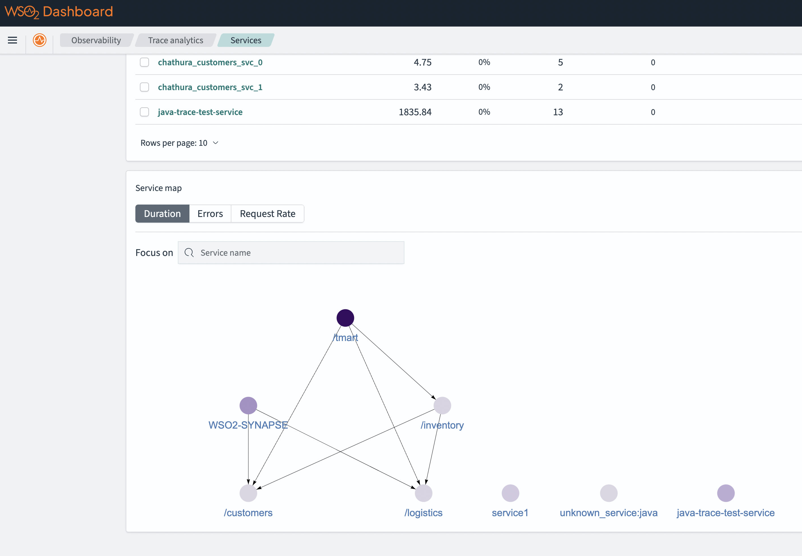
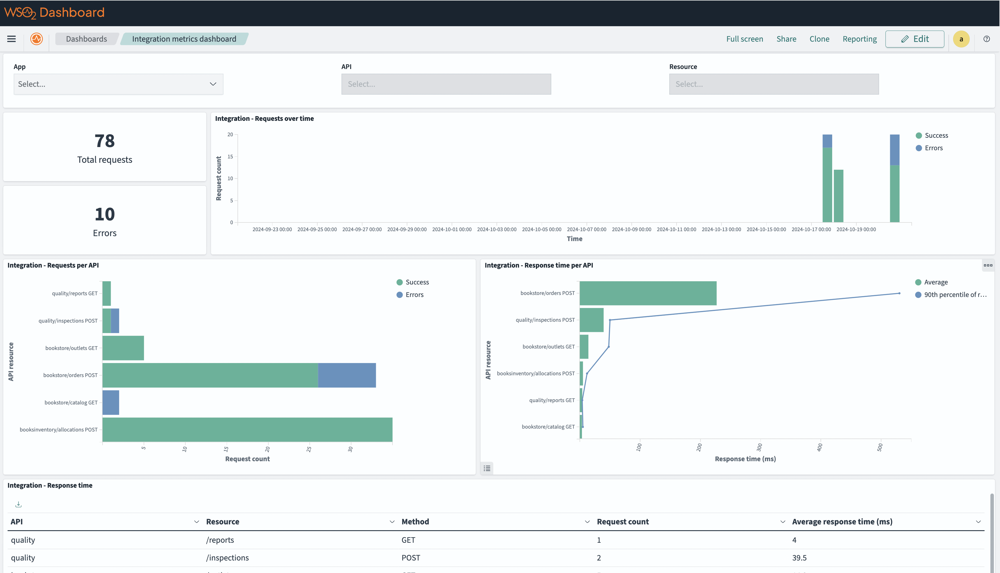

# WSO2 Observability Solution

WSO2 observability solution provides monitoring and analytics capabilities for WSO2 products based on open source products and standards such as OpenSearch, Fluent-Bit, and Open Telemetry.

## Installation

### Kubernetes

#### Prerequisites

- **Kubernetes:**
 For trying out the solution, it is possible to set up a Kubernetes cluster locally using the [Rancher Desktop](https://docs.rancherdesktop.io/getting-started/installation) or the [Docker Desktop](https://www.docker.com/get-started/). Alternatively, any on-premise or cloud-based Kubernetes cluster such as [Azure Kubernetes Service (AKS)](https://azure.microsoft.com/en-us/products/kubernetes-service) or [Amazon Elastic Kubernetes Service (EKS)](https://aws.amazon.com/eks/) can be used. A Kubernetes cluster with at least 8 vCPUs and 12 GB memory is recommended for the observability solution.

- **Helm:**
Rancher Desktop has Helm built-in. If not, install [Helm](https://helm.sh/docs/intro/install/)

The following prerequisites are required only for trying out samples.

- **Ballerina:** Install the [Ballerina programming laguage](https://ballerina.io/downloads/).

- **Maven:** [Download](https://maven.apache.org/download.cgi) and [install](https://maven.apache.org/install.html) the Maven build system.

- **Postman:** Download and install the [Postman](https://www.postman.com/downloads/) client for invoking sample APIs. 

#### Deploying the observability solution

Once the prerequisites are setup, the observability solution can be deployed by executing the provided installation script.

1. Clone [this](https://github.com/wso2/observability-resources) repository to a local folder.

2. Navigate to the `<local_folder>/observability-resources/observability/k8s/` folder and execute the installation script using the following command.
```
sh deploy-observability.sh
```
3. Access the observability dashboard
    - Port forward 5601, which is used by the observability dashboard.
    ```
    kubectl port-forward svc/opensearch-dashboards 5601:5601 -n observability
    ```
    - Log in to the OpenSearch dashboard at URL [http://localhost:5601](http://localhost:5601) using the default credentials *(username: admin, password: admin)* 
    - Navigate to *Dashboards* menu.  Click on the *Integration logs dashboard* or *Integration metrics dashboard* to view the required dashboard.

#### Deploying samples

1. Navigate to the `<local_folder>/observability-resources/samples/k8s/` folder and execute the following command to build and deploy all samples:
```
sh deploy_samples.sh
```

2. Port forward 8290 and 9100, which are used by MI and Ballerina deployments.
```
kubectl port-forward svc/bookpark-svc 8290:8290
kubectl port-forward svc/portal-svc 9100:9100
```

### VM

#### Prerequisites

The following prerequisites are needed for deployments on Mac OS. 

>The provided deployment script will check and install missing prerequisites automatically on Debian-based environments.

- **Puppet:** [Puppet](https://www.puppet.com/docs/puppet/8/install_agents#install_agents) is used as the deployment automation system for VM-based deployments.
    - Install the puppetlabs-apt module via
        ```
        puppet module install puppetlabs-apt --version 9.4.0 --modulepath /opt/puppetlabs/puppet/modules/
        ```
    - Install the puppetlabs-docker module via
        ```
        puppet module install puppetlabs-docker --version 10.0.1 --modulepath /opt/puppetlabs/puppet/modules/
        ```

- **JDK 17:** Install [Java Development Kit 17](https://jdk.java.net/archive/)

- **Ballerina:** Install the [Ballerina programming laguage](https://ballerina.io/downloads/).

- **Maven:** [Download](https://maven.apache.org/download.cgi) and [install](https://maven.apache.org/install.html) the Maven build system.

- **wget:** Install wget using the relevant package manager. E.g. for Mac OS: `brew install wget`

- **Postman:** Download and install the [Postman](https://www.postman.com/downloads/) client for invoking sample APIs. 

#### Deploying the observability solution

Once the prerequisites are setup, the observability solution can be deployed by executing the provided installation script.

1. Clone [this](https://github.com/wso2/observability-resources) repository to a local folder.

2. Navigate to the `<local_folder>/observability-resources/observability/vm/` folder and execute the installation script using the following command.

 - Mac OS
    ```
    sh deploy.sh local
    ```
 - Linux (Observability components will be installed as services in Linux. Therefore, `sudo` access is required.)
    ```
    sudo -E sh deploy.sh local
    ```

    Local deployment deploys all components of the observability solution in a single VM. For production deployments, it is recommended to deploy each component in a separate VM by executing deploy.sh followed by the component name as follows:
        - Install OpenSearch: `sh deploy.sh opensearch`
        - Install OpenSearch Dashboards: `sh deploy.sh opensearch-dashboards`
        - Install Fluent Bit: `sh deploy.sh fluentbit` 
        - Install Data Prepper: `sh deploy.sh data-prepper`
    
    Observability components will be deployed as services in Debian-based systems. Therefore, it is required to run the deployment script as the super user in such systems as follows: `sudo -E bash deploy.sh local`

3. Access the observability dashboard
    - Log in to the OpenSearch dashboard at URL [http://localhost:5601](http://localhost:5601) using the default credentials *(username: admin, password: Observer_123)* 
    - Navigate to *Dashboards* menu.  Click on the *Integration logs dashboard* or *Integration metrics dashboard* to view the required dashboard.

#### Deploying samples

1. Download WSO2 Micro Integrator from [here](https://wso2.com/integrator/micro-integrator/) and copy the zip file to the `<local_folder>/observability-resources/files/` folder.

2. Navigate to the `<local_folder>/observability-resources/samples/kvm/` folder and execute the following command to build samples and copy binaries to relevant puppet locations:
```
sh deploy.sh prepare
```

3. Run the following command to deploy samples on the local machine:
```
sh deploy.sh local
```

4. Import `<local_folder>/observability-resources/samples/postman/WSO2_Observability.postman_collection.json` to Postman. This contains various requests that cause deployed MI and Ballerina pods to generate logs, tracing data, and metrics data.

## Sample scenarios

A set of sample Ballerina and Micro Integrator deployments are included to try out this solution. Depending on the request payload, these samples generate logs, tracing data, and metrics data, which can be visualized in observability dashboards.

Below are the interactions among sample services when invoking Postman requests.

**Ballerina - Place order**\
Multiple Ballerina services are invoked as shown below:


**Ballerina - Place order Inventory error**\
Same as *Ballerina - Place order*, but the inventory service causes an error.

**Ballerina - Place order Shipment error**\
Same as *Ballerina - Place order*, but the shipment service causes an error.

**Ballerina - Place order CRM error**\
Same as *Ballerina - Place order*, but the CRM service causes an error.

**MI - Inspection**\
Invokes the Quality inspection service deployed in MI

**MI - Inspection Error**\
Invokes the Quality inspection service deployed in MI, but causes an error

**MI - Inventory**\
Invokes the Inventory service deployed in MI

**MI - Bookstore**\
Multiple MI and Ballerina services are invoked as shown below:


**Ballerina - Place order Inventory error**\
Same as *MI - Bookstore*, but the shipment service causes an error.

**Bal_MI - Place book order**\
Multiple MI and Ballerina services are invoked as shown below:


After invoking few Postman requests, observability data related to those invocations can be view as follows.

1. In the OpenSearch dashboard, Navigate to `Dashboards -> Integration logs dashboard` to view log analytics of MI and Ballerina deployments. A logs dashboard, similar to the one shown below, will be displayed with details of MI and Ballerina logs.


2. Navigate to `Observability -> Traces` tab to view tracing data of MI and Ballerina service invocations.



3. Navigate to `Dashboards -> Integration metrics dashboard` to view metrics data.


